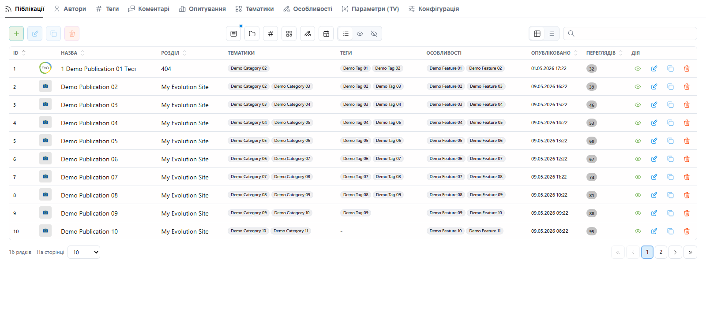
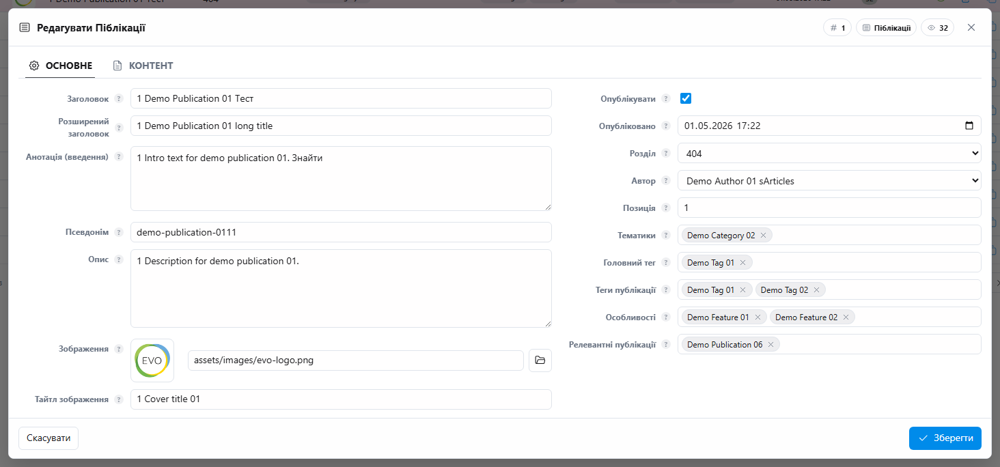
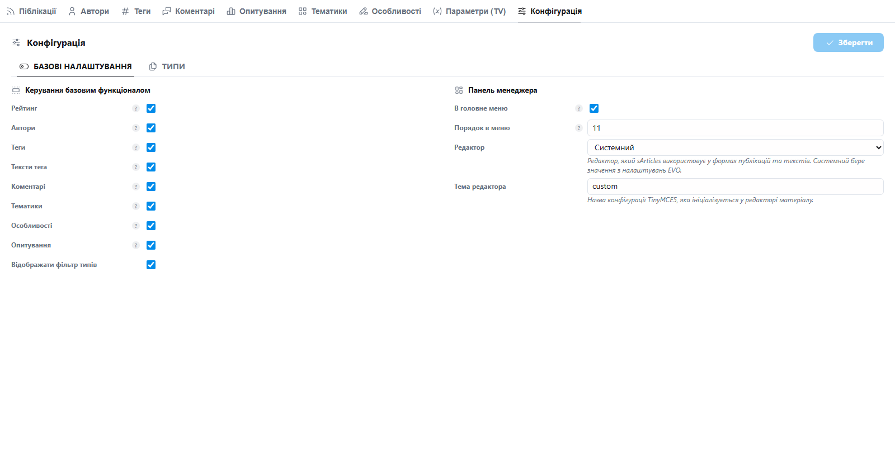

# sArticles for Evolution CMS

[](https://packagist.org/packages/seiger/sarticles)
[](https://github.com/evolution-cms/evolution)

[](https://packagist.org/packages/seiger/sarticles)
[](https://github.com/Seiger/sarticles/issues)
[](https://packagist.org/packages/seiger/sarticles)

**sArticles** is a publications, news, and blog management module for the Evolution CMS manager.

The current manager interface is rebuilt on top of **EvoUI** and **Livewire**. It works as a responsive SPA-like manager module: tabs, filters, sorting, pagination, modal forms, inline actions, and content editing update through Livewire instead of full iframe reloads.



## Features

- Publications with multiple configurable resource types.
- EvoUI tables with table/list views, filters, search, sorting, pagination, selection, bulk-style actions, and session state.
- Large modal article editor with main fields, relations, SEO fields, multilingual tabs, and a content builder.
- Content builder blocks: RichText, SingleImg, Image and Text, YouTube, Quote, Note, ArticlePreview, Poll, Slider, Accordion, and File.
- Authors, tags, tag texts, topics, features, comments, polls, and TV parameter management.
- Native optional integrations with `sSeo`, `sLang`, `eTinyMCE`, and `dTui.editor`.
- Publication comments, rating, poll votes, view tracking, aliases, and frontend helper API.
- Configurable module settings stored in `core/custom/config/seiger/settings/sArticles.php`.

## Screenshots

### Article editor



### Module settings



## Requirements

- PHP `^8.4`
- Evolution CMS `^3.5.7`
- `evolution-cms/evo-ui` `^1.0`
- Livewire, as provided by the Evolution CMS/EvoUI runtime

Optional packages:

- `seiger/sseo` for SEO fields and sitemap metadata.
- `seiger/slang` for multilingual content.
- `eTinyMCE` or `dTui.editor` for rich text fields.

## Installation

Run inside the Evolution CMS `core` directory.

```console
php artisan package:installrequire seiger/sarticles "*"
php artisan vendor:publish --provider="Seiger\\sArticles\\sArticlesServiceProvider" --tag=sarticles
php artisan migrate
```

In Extras-based development environments the package can also be installed with the Evolution Extras command used by the project:

```console
php artisan extras extras "sArticles"
```

After publishing, review:

```text
core/custom/config/seiger/settings/sArticles.php
```

## Builder Render Customization

Builder block HTML is rendered through lowercase Laravel package views such as:

```text
sarticles::render.richtext
sarticles::render.quote
```

To customize markup, copy only the needed package view into the site override path:

```text
views/vendor/sarticles/render/richtext.blade.php
views/vendor/sarticles/render/quote.blade.php
```

Existing articles keep materialized HTML in the `content` column. After changing render views,
refresh stored HTML explicitly:

```console
php artisan sarticles:rerender --dry-run
php artisan sarticles:rerender --articles=123-10000 --chunk=200
```

## Documentation

Localized documentation lives in `docs/`:

- [English](docs/en/README.md)
- [Ukrainian](docs/ua/README.md)
- [Ukrainian `uk` locale](docs/uk/README.md)
- [Russian](docs/ru/README.md)
- [German](docs/de/README.md)
- [French](docs/fr/README.md)
- [Polish](docs/pl/README.md)

Each language contains a user guide and a developer guide.

## Quick Frontend Usage

```php
@php($articles = sArticles::all(10))

@foreach($articles as $article)
    <a href="{{ $article->link }}">{{ $article->pagetitle }}</a>
@endforeach
```

Useful facade methods:

- `sArticles::all($paginate = 30)`
- `sArticles::comments($paginate = 30, $articleIds = [])`
- `sArticles::getArticle($id)`
- `sArticles::getArticleByAlias($alias)`
- `sArticles::resolveArticleByUri($segments)`
- `sArticles::trackView($article)`
- `sArticles::showPoll($id)`
- `sArticles::ratingVotes($id)`
- `sArticles::setComment($id)`
- `sArticles::publishArticle()`
- `sArticles::config($key, $default = null)`

The `sArticles::` facade is registered by the package service provider at runtime. Projects do
not need to publish a custom `core/custom/config/app/aliases/sArticles.php` file to use this
public API.

## Native Integrations

### EvoUI + Livewire

sArticles registers an EvoUI module panel and table/form presets. The manager UI is driven by Livewire components and package config files:

- `config/articles/table.php`
- `config/articles/modal.php`
- `config/*/table.php`
- `config/settings/form.php`

### sSeo

When `sSeo` is installed, sArticles stores SEO data for resource type `article`.

- Without `sLang`, SEO fields are shown as a standalone SEO area in the article modal.
- With `sLang`, SEO fields are attached to each language flow.

### sLang

When `sLang` is installed, article modal tabs are generated from the language configuration. Shared article data remains global, while translated fields and content are saved per language.

### Rich Text Editors

The module setting `general.editor` controls which editor sArticles uses:

- `system` uses EVO `which_editor`.
- A registered editor name, such as `eTinyMCE` or `dTuiEditor`, forces that editor inside sArticles.

Per-field editor selectors are intentionally hidden in sArticles forms to keep the article UI compact and predictable.

## Development Notes

- The new manager UI is config-driven and uses EvoUI/Livewire.
- Legacy manager blades, scripts, and styles are removed from the new flow.
- Use `EVO_*` constants for Evolution paths; old compatibility aliases should not be used in new code.
- Keep module-specific hooks in sArticles, not in EvoUI.
- Use table presets for manager lists and modal presets for edit/create flows.

## License

GPL-3.0-or-later.
